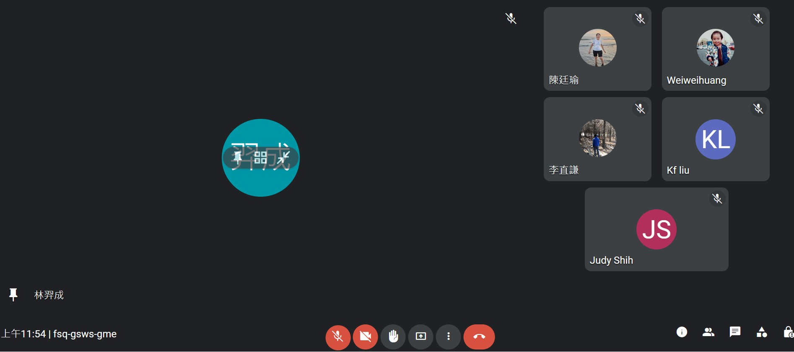
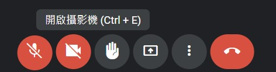
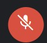
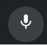
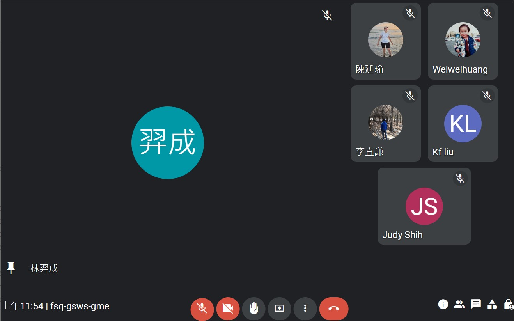

# Web programming HW#1
### Environment
Please use **Chrome** or **Edge** to ensure the html can be rendered properly.
### Functions
1. All the basic requirements are done.
	- 在畫⾯上的中間與左/上部分顯⽰被 anchored 的「主畫⾯」 (如作業封⾯所⽰之 “鐘揚”)，正中央有個圓顯⽰主畫⾯的使⽤者名稱或是頭像，右上角顯⽰是否靜⾳，左下角顯⽰此畫⾯已被 anchored 以及使⽤者名稱 (如果是⾃⼰，則顯⽰「你」)。主畫⾯、中間的圓、右上與左下的資訊，皆應為不同的HTML elements，請勿直接貼上⼀張截圖。

	- 右邊顯⽰五個其他的會議參與者，排列⽅式如封⾯圖所⽰。每位參與者畫⾯的中間有個圓顯⽰使⽤者的名稱或是頭像，右上角顯⽰是否靜⾳，左下角顯⽰使⽤者名稱 (如果是自己，則顯⽰「你」)。主畫⾯、中間的圓、右上與左下的資訊，皆應為不同的 HTML elements，請勿直接貼上⼀張截圖。
	- 下⽅的資訊/功能由左⾄右依序顯⽰時間、會議名稱、⼀些功能按鈕、⼀些會議資訊按鈕等。你可以選擇讓這整個下⽅ bar 是⼀張截圖 (假畫⾯)，但這樣就無法實現進階功能，請⾃⾏斟酌。
	- 當滑鼠游標進入(hover)主畫⾯時，中間的圓會浮現出三個額外的功能按鈕，並以⼀個半透明的橢圓形包覆起來，如下左圖，⽽當游標進入此橢圓時，則此橢圓形的透明度會降低(顏⾊變深)。
	
2. All the advanced requirements are done.
	- 當游標滑⾄每個功能按鈕之上(hover)時，會在功能按鈕上⽅顯⽰此功能之提⽰。
		
	- 點擊靜⾳按鈕時，可以切換靜⾳/無靜⾳。當然，不⽤真的做到有聲⾳與影像的功能，只是做出按鈕圖⽰變換的效果。
		- Before clicked: 
		- After clicked: 
	- 做到「Responsive Web Design (RWD)」，讓網⾴在放⼤、縮⼩時排版不⾄於亂掉，⽽仍保有原來完整的功能。
		
